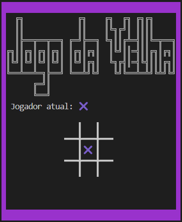
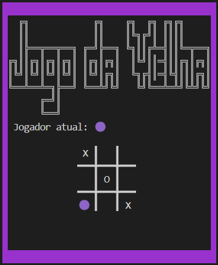
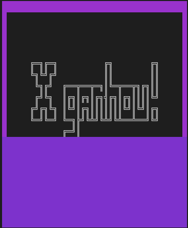

<h1>Jogo da Velha</h1>

Este jogo foi desenvolvido nas aulas de Laboratório de Programação I, curso de Sistemas de Informação, UFSM, com o professor Benhur Stein.

O programa utiliza-se do arquivo <b>tela.c</b> e <b>tecla.c</b>, desenvolvidos pelo professor para auxiliar no desenvolvimento do jogo.

<h2>Rodando o programa e dependências</h2>

O jogo foi desenvolvido em um ambiente Linux (WSL - Ubuntu) e roda no próprio terminal.

<ul>
  <li>Compilação manual: <b>gcc -o tic-tac-toe tic-tac-toe.c tela.c tecla.c</b></li>
  <li>Para executar: <b>./tic-tac-toe</b></li>
</ul>
<h2>Como jogar?</h2>

Basicamente, o jogo funciona com comandos do teclado:

<ul>
  <li>Enter => atribui o número atual à casa no tabuleiro onde o player está.</li>
  <li>A, W, S, D => controlam a movimentação do player no tabuleiro;</li>
</ul>
<h2>Imagens</h2>

Seguem abaixo algumas imagens da interface do jogo.

